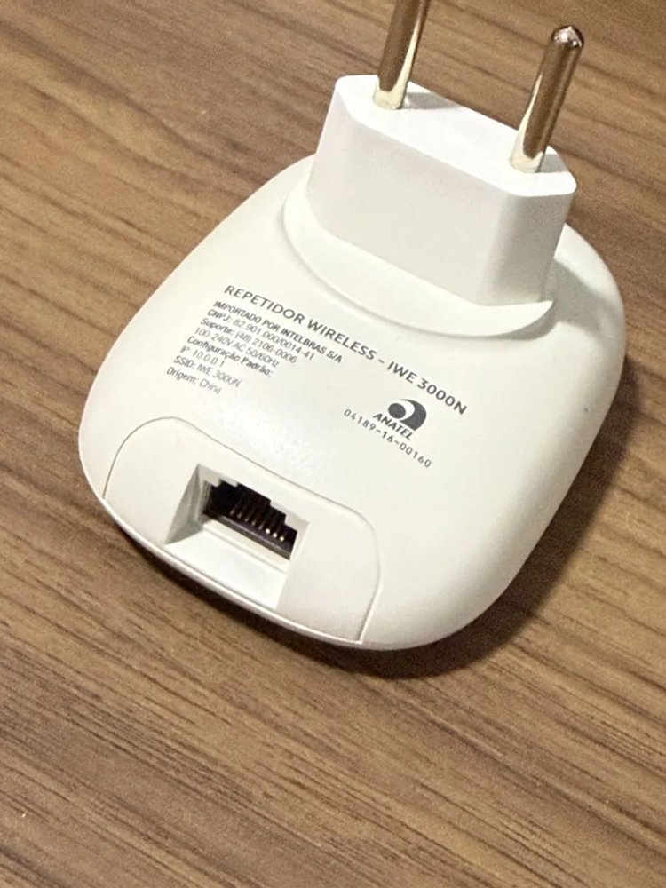
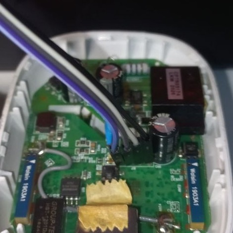
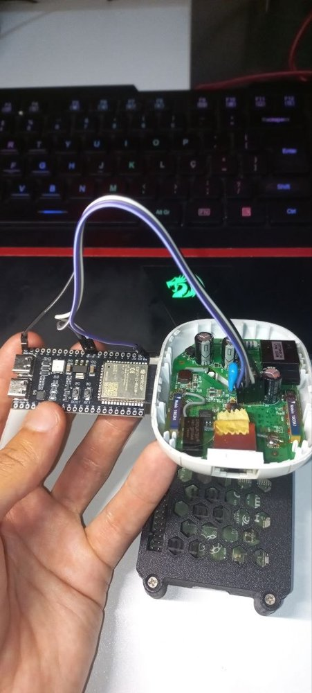

# openwrt-intelbras-iwe3000n-v1

<p align="center"></p>

Mainline **Linux 6.18** for the **Intelbras IWE 3000N v1** — RealTek **RTL8196E**
SoC, 4 MB flash, 32 MB RAM, one RTL8192EE 2.4 GHz radio. This repo is a **build
recipe**: `build.sh` overlays `./files/` and `./patches/` onto a pinned
[jnilo1/rtl8196e-gateway](https://github.com/jnilo1/rtl8196e-gateway) checkout
(v4.2.0) and produces a kernel image and a squashfs rootfs image, both flashed
through the stock RealTek loader's TFTP.

Headline: **the radio runs on mainline `rtl8192ee`** — over a PCIe host-controller
driver written for this SoC, with hostapd on nl80211 — and a WPA2 client
associates and passes traffic. As far as this project can establish it is the
first mainline kernel on any Intelbras device (the OpenWrt forum's position in
January 2024 was "no Intelbras devices are supported"), and the RTL8196E's PCIe
block had no Linux host driver before this.

On the name: jnilo1's tree is mainline Linux + BusyBox + dropbear, **not
OpenWrt** — no uci, no opkg, no LuCI. The repo was named before the route was
chosen and the name stays for findability. Read it as "replacement firmware".

> ## ⚠️ Read this before flashing
>
> **IWE 3000N v1 only.** Same-named later revisions are different boards.
>
> **Flashing replaces stock's kernel and rootfs.** Both images live inside
> stock's `linux` region; the loader, and the factory block with **this unit's
> MAC and RF calibration** at `mtd0+0x6000`, are never written. That block
> exists nowhere else, which is why the rule is *nothing writes `mtd0`*.
>
> - **Back up all 4 MB of flash first and keep it off the device** — stock gives
>   you a passwordless root shell on the serial console to do it from. See
>   [`docs/RECOVERY.md`](docs/RECOVERY.md). Intelbras's own 0.8.6 image restores a
>   working stock system but not your unit's identity.
> - **Installing and recovering both need serial** (3.3 V TTL, **38400 8N1**) —
>   the loader's TFTP is the only install path and the only safety net. There is
>   no RAM-boot image for this loader; every install writes flash.
>
> **Fix these before this touches a real network:**
>
> - The AP's WPA2 passphrase is **`iwe3000n-bench`**, in this public repo
>   (`files/rootfs/etc/hostapd.conf`). Change it and rebuild the rootfs.
> - **Root password is `root`**, and **SSH is on** (dropbear, port 22): anyone
>   who joins the AP can log in as root with a password that is in this repo.
>   The SSH **host key is also shipped in the repo** and shared across all units
>   (`files/rootfs/etc/dropbear/README.md`) — it stops SSH man-in-the-middle
>   from meaning anything. Change the password and regenerate the host key
>   before this is anywhere real.
> - **Regulatory domain is hard-coded `BR`** in `hostapd.conf`; set yours.

## Status — v1.0

| | |
|---|---|
| boot | Linux 6.18.45 to a login prompt ~5 s after power-on |
| ethernet | `rtl8196e-eth`, 100 Mbit jack; iperf3 **73 Mbit/s out, 91 Mbit/s in** ([M2](docs/M2-ETHERNET.md)) |
| PCIe | from-scratch host driver `pci-rtl819x.c`; the RTL8192EE enumerates as `10ec:818b` ([M3](docs/M3-PCIE.md), [M4](docs/M4-RADIO.md)) |
| Wi-Fi | mainline `rtl8192ee` + hostapd 2.11; the WPA2-PSK AP is the default role and comes up at boot; a client authenticates, associates, completes the 4-way handshake and pings 20/20 ([M5](docs/M5-AP.md)) |
| flash | kernel 1812 KiB of 1984 (91 %), rootfs 1363 KiB of 1600 (85 %; wpa_supplicant is the big addition), 448 KiB jffs2 overlay ([M6](docs/M6-FLASH-BUDGET.md)) |
| services | **DHCP server** on the AP (`192.168.50.100`–`.200`), **SSH** (dropbear, root login), **mDNS**: in client mode the box answers as **`iwe3000n.local`** (`ssh root@iwe3000n.local`) — see the known issue about AP mode |
| client mode | `wifi-mode client` joins a WPA2 network as a station: authenticates, associates, completes the 4-way handshake, gets a DHCP lease ([how](docs/INSTALL.md#client-mode)). Two rtlwifi fixes made this possible (`patches/rtlwifi-zzzsta-station-mode.patch`) |
| button | the WPS button is live and programmable: short press runs `/etc/button/short`, long press `/etc/button/long` (default: toggle AP ↔ client); red/blue LEDs via `led` |
| memory | ~11 MiB free with the AP up and a client attached |

**Known issues, in the order they will bite you:**

- **About one cold boot in ten faults in userspace** before `System ready`
  (BusyBox `mount` takes a SIGSEGV ~4.7 s in). Power-cycle. Memory pressure made
  this frequent and is fixed; the residual smells like I/D-cache coherence on
  the Lexra core (`c-lexra.c` never invalidates the I-cache on an exec-page
  remap) and is the top open item.
- **`wlan0`'s MAC still varies per boot.** It comes from the radio chip's efuse
  and its last byte changes on each read. (`eth0` is fixed: `S40mac` reads this
  unit's real address from the H601 factory block in `mtd0` at `0x600d` and
  applies it at boot. The device-tree route would be cleaner but needs
  `CONFIG_NVMEM`, which is off, and the kernel partition is at 91 %.)
- **~23 % loss at 1 packet/s** while bursts pass clean — a power-save
  interaction, not RF. Unresolved.
- **Debug instrumentation is compiled in** (`patches/DEBUG-*`, `*-zdebug-*`:
  interrupt-controller and radio-ISR counters, `/proc/rtl819x_*`). Silent by
  default; it stays in v1.0 because the radio fixes were validated with it in
  place and their patches apply on top of it.
- **Ethernet TX is ~15 % below what the SoC can do**: upstream's on-chip
  instruction-RAM policy is disabled (`IMEM_POLICY_DISABLE=1`) because the
  wireless stack overran its window by 28 bytes.
- The second interrupt fix (`zzfix4`) was triggered by a phone joining and
  validated with the bench adapter; the phone re-test is pending.
- **mDNS only answers in client mode.** `iwe3000n.local` resolves when the box
  has joined a network. When it is serving its own AP it does not: group
  addressed frames do not cross this driver's AP path in either direction (the
  responder never sees a query, and its announcements never reach a client),
  while unicast and the DHCP exchange work normally. Use `192.168.50.1` on the
  AP. Suspected multicast handling in `rtl8192ee` (hardware address filter and
  the DTIM-buffered group-traffic path); not chased further.
- **Client mode caveats.** The radio is a single 2.4 GHz PHY: it is an AP *or*
  a station, not both (no repeater). The `/userdata` jffs2 overlay does not
  reliably mount on this board, so a persistent client config may not survive;
  `/tmp/wpa_supplicant.conf` (this boot) always works. The firmware never
  confirms the reserved-page download at association (`pr_warn_once`); the
  link works regardless.

## The hardware

| | |
|---|---|
|  | **Is yours a v1?** The label says `REPETIDOR WIRELESS – IWE 3000N`, Anatel `04189-16-00160`, default IP `10.0.0.1`, SSID `IWE 3000N`. The mains plug is built in (100–240 V); the box *is* the power supply, so mains is on the same PCB as the console header. |
|  | **One 100 Mbit RJ45**, a VLAN on the SoC's internal switch (`eth0`), and a WPS button on the front. That is all the I/O. |

| | |
|---|---|
| SoC | RealTek **RTL8196E** — Lexra **RLX4181** core (MIPS-compatible, no unaligned-load patents; stock's 3.10 kernel reports it as `cpu model 52481`), 400 MHz, 16 KiB I-cache / 8 KiB D-cache, no L2 |
| RAM | 32 MB DDR on a 16-bit bus, ~26 MB usable by Linux |
| Flash | Winbond **W25Q32**, 4 MB SPI-NOR, single-IO — layout in [`docs/RECOVERY.md`](docs/RECOVERY.md) |
| Wi-Fi | **RTL8192EE** (`10ec:818b`) on the SoC's PCIe port, 2×2 802.11b/g/n, two internal antennas |
| Bootloader | stock RealTek loader, `2015.01.14 v1.0`, stops on ESC, TFTP in, `cvimg`-headed images |
| Console | 4-pin header, **38400 8N1**, 3.3 V |

## Serial console

Left to right on the header as photographed: **3V3, TX, RX, GND**. Router TX
goes to the adapter's RX. GND first.



The bench here uses an ESP32-S3 running [uart-ota](https://github.com/ADCDS/uart-ota)
as a network serial bridge, powered from the router's 3V3 pin — which is how
every log in `docs/` was captured and how the loader gets its ESC burst:



## Installing

[`docs/INSTALL.md`](docs/INSTALL.md), in full. The shape of it:

1. Back up ([`docs/RECOVERY.md`](docs/RECOVERY.md)).
2. Reach `<RealTek>` — ESC burst after the loader's banner.
3. `tftp -m binary 192.168.1.6 -c put <kernel>.img`, watch for
   **`burn Addr =0x00010000!`** … `Flash Write Successed!`.
4. Same with `<rootfs>.img`, expecting **`burn Addr =0x00200000!`**.
5. Power-cycle. `root`/`root` on console or over `ssh root@192.168.50.1`. The
   AP `IWE3000N-test` is up and hands out DHCP; just join it.

**No serial? There is a verified network install too.** The port can be
installed over the LAN through stock's own web UI, no case-opening — see
[`docs/OTA-INSTALL.md`](docs/OTA-INSTALL.md) and the `*-webflash.bin` image on
the release page. The serial path above is the recovery path and the way back
to stock.

Prebuilt images and their checksums: [`images/`](images/README.md).

**Personal images.** `PROFILE=/path/to/profile ./build.sh release` layers
`profile/rootfs/` over the image last — your own `wifi-mode`,
`wpa_supplicant.conf`, button scripts and keys, none of which belong in this
public repo (kept in a private repo, the same way the DIR-842 port does it).

## Building

```sh
git clone https://github.com/ADCDS/openwrt-intelbras-iwe3000n-v1
cd openwrt-intelbras-iwe3000n-v1
./build.sh deps        # clones jnilo1/rtl8196e-gateway at v4.2.0, builds the toolchain container (~45 min, ~8 GB)
./build.sh release     # kernel + rootfs → out/, with sha256sums.txt
```

`build.sh` refuses to run against an upstream checkout that is not at the pin,
verifies each image's burn address, and checks both against their partitions.
Docker is the only host dependency beyond git and python3; upstream's toolchain
(GCC 15 / binutils 2.45 / musl, patched for Lexra) is built inside the
container. hostapd is prebuilt (`files/rootfs/sbin/`, built by
`tools/build-hostapd.sh` against libnl-tiny).

## What is in here

```
build.sh                    the recipe: overlay, patch, kernel, rootfs, release
files/arch/mips/boot/dts/   board DTS: memory, console, flash map, PCIe node
files/drivers/pci/          pci-rtl819x.c — the PCIe host driver (M3/M4)
files/rootfs/               /etc fixes, hostapd + config, S90wifi, firmware blobs + licence
patches/                    rtlwifi + mac80211 + irqchip fixes, and the debug probes
tools/build-hostapd.sh      how the hostapd binary was made
docs/                       one file per milestone, plus install/recovery
images/                     checksums of the released images (binaries on the release page)
```

### The kernel-side fixes, briefly

Everything a stranger needs to know is in the patch headers; the story is in
[`docs/M5-AP.md`](docs/M5-AP.md). In one paragraph: the SoC's interrupt
controller shipped with the PCIe line unrouted (`irqchip-rtl819x-route-pcie`);
mainline `rtlwifi` reads the little-endian efuse with `u16` casts and discards
the chip's calibration on a big-endian CPU (`rtlwifi-efuse-big-endian`); its
RX refill releases a descriptor to hardware before the new buffer is in it
(`rtlwifi-rx-refill-before-hw-release`); its default RX rings cost 16 MiB on a
32 MiB host (`rtlwifi-rx-ring-64`); and its ISR returns early while the driver
has the chip's interrupts disabled from process context, which on a
level-triggered INTA is a livelock — twice, in two shapes (`rtlwifi-zzfix-*`).
The first two are upstreamable as they stand; the last two want a maintainer
conversation about where the mask belongs.

## Milestones

- **M1 — boots** ✅ [`docs/M1-BOOT.md`](docs/M1-BOOT.md). First mainline boot;
  the loader's TFTP path and burn addresses established.
- **M2 — ethernet** ✅ [`docs/M2-ETHERNET.md`](docs/M2-ETHERNET.md). Measured both
  ways, with and without the I-MEM policy.
- **M3 — PCIe link** ✅ [`docs/M3-PCIE.md`](docs/M3-PCIE.md). The bring-up sequence
  was in the RTL8196E *kernel* of an old SDK, not in the Wi-Fi driver everyone
  reads; `CLK_MANAGE` bit 14 is the one that matters.
- **M4 — radio probes** ✅ [`docs/M4-RADIO.md`](docs/M4-RADIO.md). 32-bit-only
  config space; firmware must be linked into the kernel.
- **M5 — AP with a real client** ✅ [`docs/M5-AP.md`](docs/M5-AP.md). Long. Two
  retracted theories are left in, marked, because the evidence that killed them
  is the useful part.
- **M6 — fits 4 MB** ✅ [`docs/M6-FLASH-BUDGET.md`](docs/M6-FLASH-BUDGET.md).
  Including where the loader's own kernel-size ceiling is.

The planning documents that preceded them — [`FEASIBILITY.md`](docs/FEASIBILITY.md),
[`PRIOR-ART.md`](docs/PRIOR-ART.md), [`PORT-PLAN.md`](docs/PORT-PLAN.md),
[`WIFI-PLAN.md`](docs/WIFI-PLAN.md) — are kept as written on 2026-08-31, each
with a note on how it turned out.

## Licence

GPL-2.0 ([`LICENSE`](LICENSE)) for everything written here: the PCIe host
driver, the DTS, the patches, the scripts. `rtlwifi/rtl8192eefw.bin` is
Realtek's chip firmware, redistributed under linux-firmware's terms
([`files/rootfs/lib/firmware/LICENCE.rtlwifi_firmware.txt`](files/rootfs/lib/firmware/LICENCE.rtlwifi_firmware.txt));
`regulatory.db` is wireless-regdb (ISC). Upstream jnilo1/rtl8196e-gateway is
not vendored; its licence applies to its tree.
