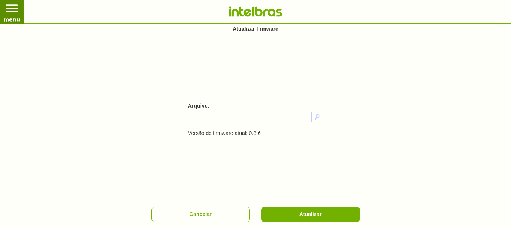
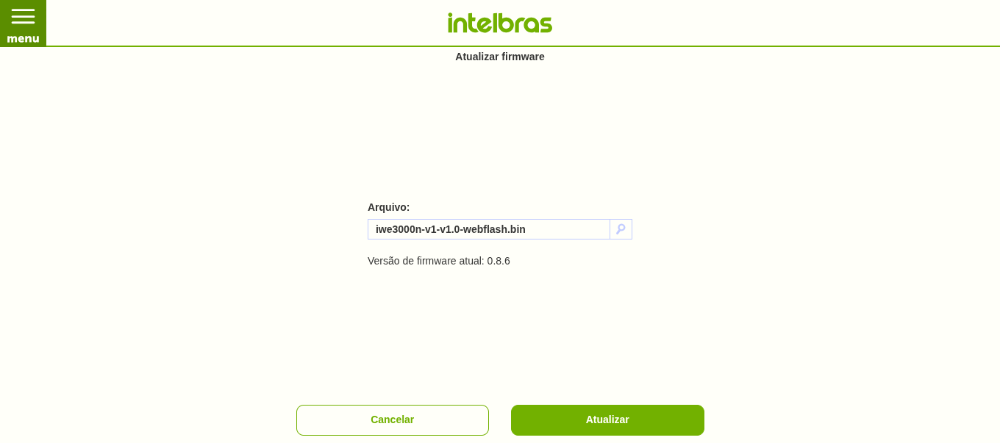
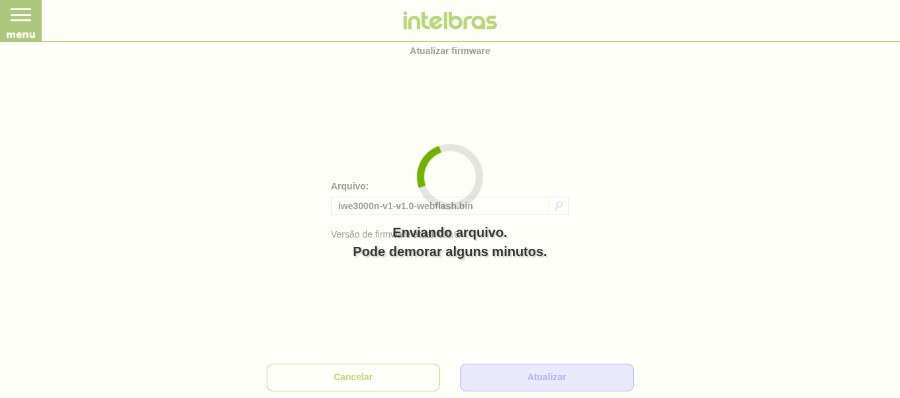

# Installing without opening the case — VERIFIED

**This works.** The port has been installed over the LAN through stock's own
web UI, with no serial console and no case-opening, and the device booted
straight into it. Stock's firmware updater accepts a vendor-shaped image,
writes it to the `linux` region, and never touches `mtd0`. `tools/mkota.py`
wraps the two v1.0 images into that container; the release ships the result as
`iwe3000n-v1-v1.0-webflash.bin`.

> ⚠ This still **replaces stock**. Have the serial recovery
> ([`RECOVERY.md`](RECOVERY.md)) available as a fallback, and a backup of your
> unit's flash — the web path is proven on the bench unit, not on every unit.

## The stock update mechanism

Stock is an OpenWrt fork and carries the whole sysupgrade stack:
`/sbin/sysupgrade`, `/sbin/mtd`, `/lib/upgrade/platform.sh`,
`/etc/sysupgrade.conf`, plus a uhttpd + Lua web UI whose firmware page is
`www/cgi-bin/modules/system/firmware/`. Stock also boots **dropbear and
telnetd** (`etc/rc.d/S50dropbear`, `S50telnet`), so a network root shell is a
second route if the admin password is known — then `mtd write combined.img
linux` needs no wrapping at all.

## The vendor image container (`iwe3000n_0.8.6.bin`, confirmed byte-exact)

| offset | size | field |
|---|---|---|
| `0x00` | 16 | **MD5 of everything from `0x10` to EOF**, unkeyed (no secret, unlike D-Link) |
| `0x10` | 4 | format tag `b3 00 aa 06` (constant) |
| `0x14` | 16 | **`cvimg` header** (`cs6c`), big-endian: load `0x80500000`, **burn `0x00010000`**, length |
| `0x24` | … | payload: OpenWrt lzma-loader + kernel, then the squashfs (`hsqs`) |
| EOF-4 | 4 | `deadc0de` |

The on-flash `mtd1` equals this file with the 20-byte prefix stripped and byte
0 = `cs6c`. So the updater **checks the MD5, strips the 20-byte prefix, and
writes the `cs6c` image to `mtd1` at `0x10000`.** There is no signing key to
forge.

## The wrapped image, and how it is built

`tools/mkota.py` builds it, and the v1.0 release ships the result as
**`iwe3000n-v1-v1.0-webflash.bin`**. What it does, checked against the exact
bytes read back from a running unit's flash:

```
mkota.py kernel.img rootfs.img -o webflash.bin --tag-from <vendor.bin>
```

The bytes the updater writes to flash (`0x10000` onward) must equal the layout
this port boots from, so the wrapper is not a repackage of the two loader
images -- it reproduces the flash:

- **flash `0x10000` = `kernel.img` verbatim.** The kernel keeps its `cs6c`
  header; the loader boots through it. So the wrapped payload begins with the
  whole `*-kernel.img`.
- **flash `0x200000` = raw squashfs (`hsqs`).** The rootfs `r6cr` header is
  *not* on flash -- the kernel mounts `/dev/mtdblock2` as squashfs, so `hsqs`
  must sit at `0x200000`. So the wrapper strips the 16-byte `r6cr` header (and
  the trailing 2-byte cvimg checksum) from `*-rootfs.img` and pads the kernel
  out to `0x1F0000` so the squashfs lands exactly at `0x200000`.

It is then wrapped in the vendor container: `[MD5(16)][tag b3 00 aa 06][kernel
+ pad + squashfs][deadc0de]`, `MD5 = md5(everything after the first 16 bytes)`.
The updater strips the 20-byte prefix and writes the rest verbatim.

Upload `webflash.bin` through the stock web UI's firmware page.

## How to do it

**1. Put your computer on the stock LAN.** Stock's default address is
`10.0.0.1`; give yourself `10.0.0.2/24` on the wired port (stock also runs a
DHCP server, so an address may arrive on its own). Open `http://10.0.0.1/` and,
from the menu, go to **Atualizar firmware** (the firmware page,
`#!/main/firmware`). Log in if asked — the bench unit's web login was the stock
default `admin` / `admin`.



**2. Choose the image.** Click the file field and pick
`iwe3000n-v1-v1.0-webflash.bin` (from the release page). The filename appears in
the box.



**3. Press Atualizar.** The page shows *"Enviando arquivo. Pode demorar alguns
minutos."* while the browser uploads the image to the device.



**4. Wait for the reboot.** The device writes flash and restarts itself into the
port; stock shows *"Seu IWE 3000N foi atualizado!"* just before it goes. The AP
`IWE3000N-test` then comes up on `192.168.50.1`. Your `10.0.0.x` address stops
working because the port is not a `10.0.0.1` repeater — join the Wi-Fi instead
(WPA2, passphrase `iwe3000n-bench`), or reach it by SSH at `root@192.168.50.1`.

## What the updater actually does (from the verified run)

- The web app reads the file, base64-encodes it in the browser, and **POSTs it
  in ~100 KB chunks** as JSON to `/cgi-bin/api/v1/system/firmware`:
  `{"action":"firmware","data":{"current":N,"total":40,"content":"<base64>"}}`,
  under HTTP Basic auth (`admin:admin` on the bench unit). Each chunk returns
  `200` with an empty body.
- After the last chunk the CGI reassembles the image, validates the 16-byte
  MD5 prefix, strips the 20-byte prefix, writes the rest to the `linux` mtd, and
  reboots. **No model/version string was enforced** — the container check is the
  MD5, which `mkota.py` computes. `mtd0` is never written.
- The wrapped image's `cs6c` burn field is `0x00010000` and the whole payload
  fits `mtd1`; keep both true for any image built this way.

Serial + loader TFTP ([`INSTALL.md`](INSTALL.md)) remains the recovery path and
the way to get *back* to stock.
